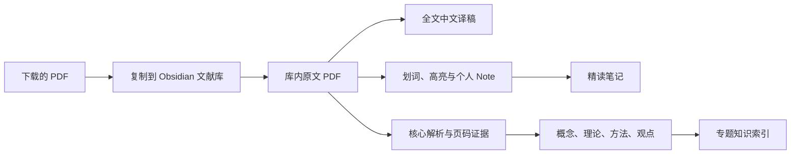

# PaperFlow｜文脉

一套面向 **Codex** 与 **Claude Code** 的 Obsidian 学术文献精读 Skill。

把 PDF 交给 AI 后，它会将原文复制进 Obsidian 仓库，建立独立的全文中文译稿、核心解析和精读笔记，并把具有复用价值的概念、理论、方法和观点连接到现有知识体系。阅读阶段配合两个 Obsidian 插件，可以完成划词翻译、可删除的持久高亮、页级批注和 Note 汇总。

这个工作流适合需要长期保存原文、反复精读、跨文献积累概念，以及希望在 Codex 或 Claude Code 中用一句指令完成归档的人。

[下载最新版 ZIP](https://github.com/MuKaramia/PaperFlow/releases/latest/download/obsidian-literature-workflow.zip) · [查看安装方法](#安装-skill) · [查看完整工作流程](#工作流程)

> 当前版本以 Obsidian 桌面端为目标。插件兼容修复基于 LLM Translator 0.3.5 与 PDF Annotator 0.2.0 测试。

## 演示

### 文化价值：从单篇文献进入知识体系


演示内容来自现有 Obsidian 库中的“文化价值测量与公共价值治理”材料。单篇文献的章节解读会继续连接到文化价值测量、公共价值测量框架、文化政策时刻等概念，以及相应的观点和专题索引。这样再次研究相关问题时，可以沿链接回到原始证据，而不必重新翻找 PDF。

### 精益创业：划词后即时查看中文


在 PDF 中选中英文段落后，LLM Translator 自动显示中文结果。翻译框可以拖动，避免遮挡正在阅读的内容。这里的译文用于即时理解，不会自动混入正式精读笔记。

### 精益创业：把原文高亮与自己的 Note 绑定


PDF Annotator 负责可长期保存的标注。可以给选中的原文添加 Note，也可以在整页添加 Page Note 或 Side note。标注会自动保存，可以重新编辑、搜索和删除。随后运行同步脚本，原文、个人 Note 和页码链接会汇总到该文献的精读笔记中。

## 它会产生什么

每篇文献默认形成一个独立文件夹：

```text
05-文献原库/
└── Author Year - Short Title/
    ├── Author Year - Short Title - 原文.pdf
    ├── Author Year - Short Title - 核心解析.md
    ├── Author Year - Short Title - 全文中文译稿.md
    └── Author Year - Short Title - 精读笔记.md
```

| 文件 | 用途 | 主要内容 |
|---|---|---|
| `原文.pdf` | 可持续访问的文献原件 | 从下载位置复制到 Obsidian。以后即使删除 Downloads 中的文件，库内副本仍然可用 |
| `核心解析.md` | 面向研究的结构化分析 | 中心论点、研究问题、概念、理论机制、方法、发现、贡献、限制和带页码证据 |
| `全文中文译稿.md` | 完整中文阅读版本 | 按原文顺序翻译正文，保留标题、引文、公式、表格编号和来源页链接 |
| `精读笔记.md` | 汇总阅读时留下的痕迹 | 原文摘录、用户自己写的 Note，以及可以返回 PDF 对应页面的链接 |

工作流还可以根据文献内容创建或更新原子笔记，例如：

```text
学科领域/
└── 某一研究主题/
    ├── 概念/
    ├── 理论/
    ├── 方法/
    ├── 观点/
    └── 专题知识索引.md
```

这些笔记只在内容具有跨文献复用价值时创建。一个只在正文中偶然出现的词，不会机械地被拆成新笔记。

## 工作流程



这里有几条固定原则：

- 原始 PDF 必须复制到 Obsidian，不能只留下指向 Downloads 的链接。
- 原文、全文译稿、分析和个人批注分开保存，避免互相覆盖。
- 临时划词译文只帮助阅读。正式笔记保留原文、自己的 Note 和页码链接。
- 结论、引文、定义和关键方法尽量回链到 PDF 页码。
- 已经存在的文件和手写内容不会被脚本静默覆盖。

## 运行环境

使用前需要：

- Obsidian Desktop。移动端不支持这里的插件安装和兼容补丁流程。
- Codex 或 Claude Code，并允许其读取 PDF、写入 Obsidian vault 和运行本地命令。
- Node.js 18 或更新版本。
- 第一次安装插件时需要联网。
- 对 Obsidian 社区插件有基本的信任判断。敏感文献建议先查看插件源码及所选翻译服务的数据政策。

## 安装 Skill

### 方法一：下载 ZIP 后交给 Codex 或 Claude Code

1. 在本仓库右上方选择 **Code → Download ZIP**。
2. 把 ZIP 拖进 Codex 或 Claude Code 对话框。
3. 输入：

```text
请把这个压缩包安装为一个可调用的 Skill，保持 obsidian-literature-workflow 为顶层文件夹，并确认 SKILL.md 可以被识别。
```

AI 应当把完整文件夹放到对应的 Skills 目录，而不是只读取一次后丢弃。

### 方法二：手动安装到 Codex

将仓库下载或克隆到：

```text
~/.codex/skills/obsidian-literature-workflow/
```

安装完成后应当存在：

```text
~/.codex/skills/obsidian-literature-workflow/SKILL.md
```

### 方法三：安装到 Claude Code

个人范围安装：

```text
~/.claude/skills/obsidian-literature-workflow/
```

只在某个项目中使用：

```text
项目目录/.claude/skills/obsidian-literature-workflow/
```

最终同样要确保 `SKILL.md` 直接位于 Skill 顶层。常见的错误是多套了一层同名目录：

```text
# 正确
skills/obsidian-literature-workflow/SKILL.md

# 错误
skills/obsidian-literature-workflow/obsidian-literature-workflow/SKILL.md
```

安装 Skill 并不会自动修改 Obsidian。只有在你明确要求配置阅读工具后，AI 才应该安装社区插件和写入 `.obsidian/`。

## 第一次使用

### 1. 让 AI 找到 Obsidian vault

可以直接说：

```text
请使用 obsidian-literature-workflow。我的 Obsidian vault 是 /你的/Obsidian/目录，先检查现有文件结构，不要改变我已经使用的分类方式。
```

Skill 会通过 `.obsidian/` 判断 vault，并优先沿用已有的目录、YAML 和命名习惯。

### 2. 安装两个核心插件

输入：

```text
请按这个工作流为当前 vault 配置划词翻译和 PDF 批注。我同意安装 LLM Translator 与 PDF Annotator。安装后请运行兼容检查，并告诉我何时需要重启 Obsidian。
```

底层命令为：

```bash
node "/absolute/path/to/obsidian-literature-workflow/scripts/setup_plugins.mjs" \
  --vault "/absolute/path/to/vault"
```

脚本会从 Obsidian 官方社区插件索引定位上游版本，安装并启用：

| 插件 | ID | 在本流程中的职责 |
|---|---|---|
| LLM Translator | `llm-translator` | 划词后提供临时中文翻译，翻译框可以移动 |
| PDF Annotator | `local-pdf-annotator` | 持久高亮、删除标注、原文 Note、Page Note 与批注检索 |

脚本还会执行经过测试的兼容处理：

- 隐藏 LLM Translator 旧式的 PDF 写入高亮按钮，避免同一段反复叠加黄色且无法稳定删除。
- 让翻译弹窗可以从顶部空白区域拖动，并限制在窗口范围内。
- 修复 PDF Annotator 创建备份时出现的 `detached ArrayBuffer` 错误。
- 修复 Page Note 或 Side note 点击后输入框失去焦点的问题。
- 默认使用 PDF Annotator 的独立阅读视图，关闭容易失配的实验性原生 PDF overlay。

完成后重启 Obsidian，或者关闭再重新启用这两个插件。

## 导入一篇文献

最简单的指令是：

```text
请按 obsidian-literature-workflow 处理这篇 PDF。把原文完整复制进我的 Obsidian 文献原库，建立全文中文译稿、核心解析和精读笔记，并把可复用的概念与现有知识索引连接起来。不要覆盖已有文件。
```

如果 PDF 不是通过对话附件提供，也可以给出路径：

```text
请按此流程处理 /Users/me/Downloads/paper.pdf。文献键名使用“作者 年份 - 英文短标题”，先归档原文，再阅读全文后完成分析。
```

归档脚本的直接用法：

```bash
node "/absolute/path/to/obsidian-literature-workflow/scripts/archive_paper.mjs" \
  --vault "/absolute/path/to/vault" \
  --pdf "/absolute/path/to/downloaded-paper.pdf" \
  --key "Author Year - Short Title"
```

这个步骤会复制 PDF 并建立三篇独立 Markdown 笔记。若目标文件已经存在，脚本会停止或保留原文件，不会默认覆盖。

## 核心解析会写什么

`核心解析.md` 关注文献对研究工作的实际价值，一般包括：

- 书目信息和原文入口。
- 一句话中心论点、研究问题与作者试图填补的空缺。
- 论证链、核心概念、理论机制和边界条件。
- 数据、样本、方法和识别或分析策略。
- 主要发现及其证据基础。
- 相对于既有文献的贡献。
- 局限、未解决问题和可讨论之处。
- 可以复用的原文引文及 PDF 页码链接。
- 与现有概念、理论、方法、观点和专题索引的双向链接。

工作流会区分作者的主张、文献报告的证据和 AI 的解释。无法确认的元数据、数字或页码应当标注为不确定，不能补写一个看似完整的答案。

## 全文中文译稿

全文翻译单独写入 `全文中文译稿.md`，不会挤进核心解析。默认要求：

- 保持原文标题层级、段落顺序、引文、编号和公式标识。
- 术语首次出现时可使用“中文术语（English term）”，之后保持译法一致。
- 在主要章节或页面边界加入来源页链接。
- 能可靠识别行列时，把表格重建为中文 Markdown 表格。
- 图表保留原图或原 PDF 页面链接，翻译图题、表题和可辨认标签。
- OCR 缺字、不可辨公式和模糊图表必须明确标记，不能猜测。

扫描版 PDF 没有可选中的文字层，需要先进行 OCR。复杂图表的中文版通常需要人工复核，特别是坐标轴、图例和脚注密集的页面。

OPEN PDF Translate 可以作为可选的视觉覆盖工具，但不是必需依赖。长期保存的完整译文仍以 Obsidian 中的 Markdown 文件为准。

## 精读时怎么划词、翻译和写 Note

### 临时划词翻译

1. 在 PDF 中选中英文。
2. 等待 LLM Translator 弹出中文。
3. 从弹窗顶部语言栏的空白处拖动它。
4. 读完后可以直接关闭。它不会自动进入精读笔记。

### 给一段原文添加 Note

1. 使用 PDF Annotator 视图打开库内的 `原文.pdf`。
2. 选中要保存的原文。
3. 点击 **Annotate**，选择标记方式。
4. 在对应的 **Note** 输入框中写下自己的理解、疑问或用途。

Note 自动保存。重新打开 Obsidian 后，原文高亮和 Note 应当仍然存在。

### 给整页添加 Note

1. 点击工具栏上的 **Tag**。
2. 在页面中放置标签。
3. 在 **Page note** 或 **Side note** 中输入内容。

### 删除高亮或批注

右键点击现有标记或批注卡片，选择 **Delete** 或 **Delete annotation**。不要在同一段文字上反复点击旧式黄色高亮按钮，这会把多个标注写入 PDF，`Command+Z` 只能撤回当前会话里的最近操作。

## 把 PDF Note 汇总成一篇精读笔记

完成一轮阅读后，可以对 AI 说：

```text
请使用 obsidian-literature-workflow，同步这篇 PDF 的全部批注到精读笔记。只保留原文、我写的 Note 和页码链接，不要收录划词产生的中文翻译，也不要改动自动管理区域之外的手写内容。
```

底层命令：

```bash
node "/absolute/path/to/obsidian-literature-workflow/scripts/sync_annotations.mjs" \
  --vault "/absolute/path/to/vault" \
  --pdf "05-文献原库/Author Year - Short Title/Author Year - Short Title - 原文.pdf"
```

生成内容大致如下：

```markdown
## p. 12

> The market opportunity that a startup seeks to exploit defines the domain...

**我的 Note**

这里的“市场机会”同时决定竞争边界、价值创造方式和后续验证范围。

[[Author Year - Short Title - 原文.pdf#page=12|返回原文第 12 页]]
```

脚本只更新下面两个标记之间的内容：

```html
<!-- PDF-ANNOTATIONS:START -->
自动汇总的批注
<!-- PDF-ANNOTATIONS:END -->
```

你在标记区域之外写的综合判断、研究联想和后续问题会被保留。重复同步不会不断复制同一批内容。

## 常用指令

只归档，不开始翻译：

```text
请用 obsidian-literature-workflow 归档这篇 PDF，先复制原文并建立三篇空白笔记，暂时不要阅读全文。
```

只补全文译稿：

```text
请按照原文顺序补完全文中文译稿，保留章节、引文、公式编号、图表标题和页面链接。不要把分析混入译稿。
```

更新知识网络：

```text
请检查这篇文献里哪些概念和观点值得跨文献复用，只为真正有检索价值的内容建立原子笔记，并更新最近的专题知识索引。
```

检查插件状态：

```text
请使用 obsidian-literature-workflow 检查两个阅读插件。验证划词翻译框能移动，PDF 标注可以添加、保存和删除，Page Note 可以正常输入。不要删除我已有的批注。
```

## 数据保存在哪里

PDF Annotator 的批注和校验备份存放在 vault 内部：

```text
.pdf-annotator/
└── bundles/
    └── sha256/
        └── <文献哈希>/
            ├── annotations.md
            └── document.pdf
```

`document.pdf` 是供批注系统恢复使用的校验副本。它补充可见的 `05-文献原库/.../原文.pdf`，不能代替日常可访问的文献原件。

## 隐私与安全

- 归档脚本只复制输入 PDF，不会删除下载目录中的原文件。
- Skill 不包含 API Key，也不要求把 Obsidian vault 上传到 GitHub。
- LLM Translator 使用哪个翻译提供商，决定选中文字是否会发送到外部服务。未公开的论文、访谈材料和敏感数据建议使用本地模型，或先确认服务商的数据政策。
- Obsidian 社区插件通常拥有读取 vault 内容的能力。安装前应当确认上游仓库和版本，重要 vault 建议定期备份。
- 本仓库中的演示截图仅用于说明界面和工作结果，发布包不包含用户的完整 Obsidian 仓库或原始学术 PDF。

## 常见问题

### Skill 没有被识别

检查是否存在 `skills/obsidian-literature-workflow/SKILL.md`，并排除双层同名文件夹。安装后重新启动 Codex 或 Claude Code 会话。

### 提示找不到脚本

三个脚本都应当相对于 `SKILL.md` 所在目录解析。不要假定当前终端目录就是 Skill 目录。让 AI 先定位 `SKILL.md`，再使用脚本的绝对路径。

### 出现 `could not attach the annotation overlay`

这是实验性原生 PDF overlay 没有找到 Obsidian 当前的 PDF DOM。使用 PDF Annotator 独立视图，并确保配置中：

```json
{
  "registerAsDefaultPdfHandler": true,
  "enableNativeOverlay": false
}
```

然后重启插件，关闭原 PDF 标签页并重新打开。

### 出现 `Cannot perform Construct on a detached ArrayBuffer`

重新运行插件配置脚本并重启 Obsidian。当前补丁会给 PDF.js 传入缓冲区副本，将原缓冲区保留给哈希校验和备份。

### Page Note 或 Side note 无法输入

重新运行配置脚本。修复会避免激活中的批注卡片在输入框获得焦点时立即重绘。

### 高亮能够添加，但不能删除

先判断高亮来自哪个插件。长期批注统一使用 PDF Annotator，并通过右键菜单删除。LLM Translator 只负责划词翻译，其旧式 PDF 高亮入口会被隐藏，以免出现重叠黄色标记。

### 插件更新后功能失效

运行：

```bash
node "/absolute/path/to/obsidian-literature-workflow/scripts/setup_plugins.mjs" \
  --vault "/absolute/path/to/vault" \
  --skip-download
```

补丁脚本只处理已知代码或已应用状态。遇到未知上游版本会停止并报告，不会对无法识别的插件文件强行替换。

## 已知边界

- 目前面向 Obsidian Desktop。
- 扫描 PDF 需要额外 OCR。
- 全文翻译质量取决于所使用的模型、文本提取质量和文献领域。
- 图表中的小字号、旋转文字和复杂公式需要人工校对。
- 插件补丁与上游版本有关。上游实现发生变化时，应先检查代码再适配。
- Skill 能规范阅读和整理步骤，不能代替对研究设计、证据强弱和理论贡献的人工判断。

## 更新与卸载

更新 Skill 时，可以下载最新仓库并替换 Skill 文件夹。替换前保留自己修改过的模板。

卸载时删除：

```text
~/.codex/skills/obsidian-literature-workflow/
```

或：

```text
~/.claude/skills/obsidian-literature-workflow/
```

这不会删除已经归档到 Obsidian 的 PDF、译稿、核心解析和精读笔记。若不再需要两个社区插件，可以在 Obsidian 的“第三方插件”页面中停用或卸载。

## 仓库结构

```text
obsidian-literature-workflow/
├── SKILL.md
├── README.md
├── LICENSE
├── agents/
│   └── openai.yaml
├── assets/
│   ├── screenshots/
│   ├── paper-analysis-template.md
│   ├── full-translation-template.md
│   └── reading-notes-template.md
├── references/
│   ├── plugin-workflow.md
│   └── vault-schema.md
└── scripts/
    ├── setup_plugins.mjs
    ├── archive_paper.mjs
    └── sync_annotations.mjs
```

`SKILL.md` 是代理实际遵循的工作说明，`README.md` 面向安装和使用者。`references/` 保存详细规则与故障处理，`assets/` 提供笔记模板，`scripts/` 负责可重复执行的插件配置、原文归档和批注同步。

## 上游项目

本工作流使用并尊重以下独立社区项目：

- [LLM Translator](https://github.com/kimfischer99/Obsidian-LLM-Translator)
- [PDF Annotator](https://github.com/alexandert142/Alex-annotator)
- [OPEN PDF Translate](https://github.com/vetrenar/Open-PDF-Translate)，可选

各插件仍遵循其自己的许可证和发布方式。本仓库对兼容问题所做的处理集中在安装脚本中，方便检查和撤销。

## License

本项目使用 [MIT License](LICENSE)。你可以使用、修改和再发布这套工作流，但需要保留原许可证和版权声明。
