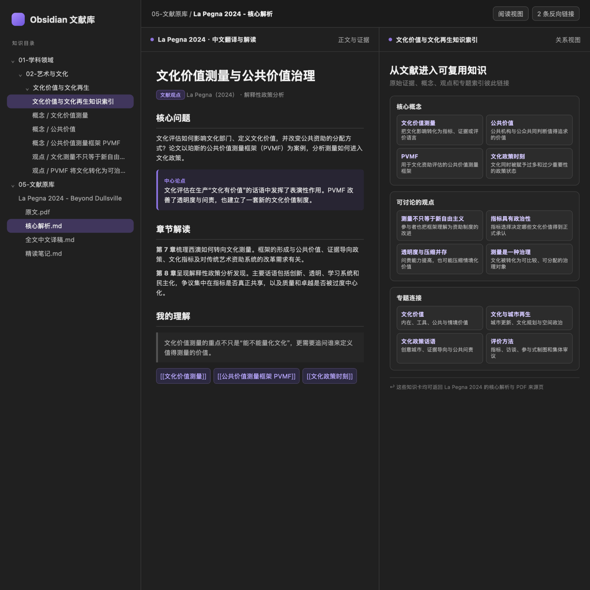
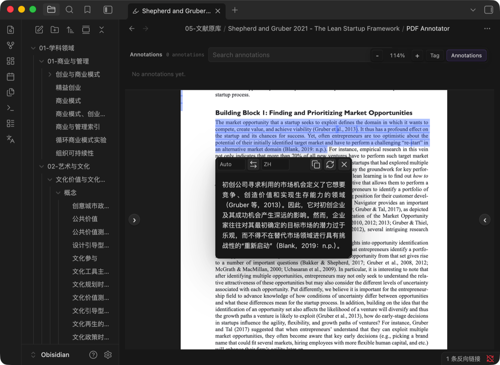
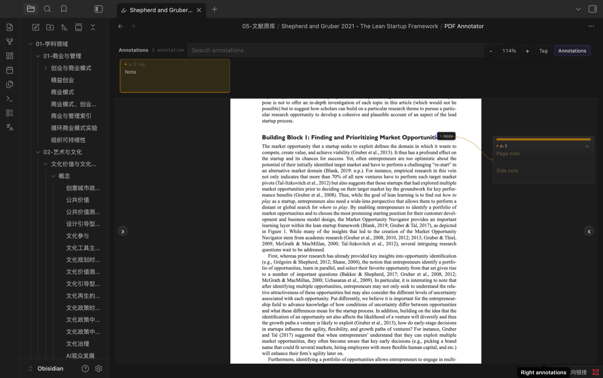
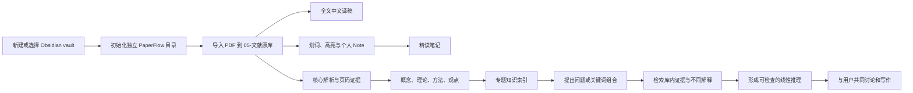

# PaperFlow

一套面向 **Codex、Claude Code、Kimi Code、腾讯 CodeBuddy 与 WorkBuddy** 的 Obsidian 研究工作流。一次安装包含两个可以独立调用、彼此衔接的 Skill：

- **PaperFlow Atlas｜文献知识地图**：保存原文、全文翻译、核心解析与个人批注，把概念、理论、方法和观点连接成可追溯的知识网络。
- **PaperFlow Thread｜线性论证脉络**：从研究问题或多个关键词出发，检索用户自己的 Obsidian 库，将网状材料梳理成层层相扣的论证线。

> ## 想和你一起，把问题慢慢想清楚
>
> PaperFlow 想陪你把散落的阅读、还没有成形的念头，以及那些一闪而过却很重要的问题，慢慢织成属于你自己的研究。它会认真听你怎么想，陪你寻找线索、讨论不同的可能，也会诚实提醒你哪里还需要证据。

> **PaperFlow does not write over your thinking. It writes with you.**

Atlas 负责从 PDF 到知识网络，Thread 负责从知识网络到论证线。这个工作流适合需要长期保存原文、反复精读、跨文献积累概念，并希望进一步把分散材料组织成清晰论证脉络的研究者。

> **推荐做法：为 PaperFlow 单独新建一个 Obsidian vault。** 这样文献原文、概念、理论、方法和研究项目从一开始就处在统一结构中。如果希望继续使用原来的 vault，首次运行也只会建立一个独立的 `PaperFlow/` 根目录，不会把新文献混入旧分类。已有文献不会自动迁移，需要用户明确要求智能体导入。

[通用插件 ZIP](https://github.com/MuKaramia/PaperFlow/releases/latest/download/paperflow-universal.zip) · [Kimi Code 版](https://github.com/MuKaramia/PaperFlow/releases/latest/download/paperflow-kimi-code.zip) · [WorkBuddy 上传版](https://github.com/MuKaramia/PaperFlow/releases/latest/download/paperflow-workbuddy.zip) · [查看安装方法](#安装-paperflow)

> 当前版本以 Obsidian 桌面端为目标。插件兼容修复基于 LLM Translator 0.3.5 与 PDF Annotator 0.2.0 测试。

## 演示

### 文化价值：从单篇文献进入知识体系



演示内容来自现有 Obsidian 库中的“文化价值测量与公共价值治理”材料。单篇文献的章节解读会继续连接到文化价值测量、公共价值测量框架、文化政策时刻等概念，以及相应的观点和专题索引。这样再次研究相关问题时，可以沿链接回到原始证据，而不必重新翻找 PDF。

### 精益创业：划词后即时查看中文



在 PDF 中选中英文段落后，LLM Translator 自动显示中文结果。翻译框可以拖动，避免遮挡正在阅读的内容。这里的译文用于即时理解，不会自动混入正式精读笔记。

### 精益创业：把原文高亮与自己的 Note 绑定



PDF Annotator 负责可长期保存的标注。可以给选中的原文添加 Note，也可以在整页添加 Page Note 或 Side note。标注会自动保存，可以重新编辑、搜索和删除。随后运行同步脚本，原文、个人 Note 和页码链接会汇总到该文献的精读笔记中。

## Atlas 会产生什么

首次运行后，PaperFlow 会在选定的 Obsidian vault 中建立自己的完整目录：

```text
PaperFlow/
├── PaperFlow 首页.md
├── 01-学科领域/
├── 02-跨领域概念/
├── 03-理论与模型/
├── 04-研究方法/
├── 05-文献原库/
│   └── Author Year - Short Title/
│       ├── Author Year - Short Title - 原文.pdf
│       ├── Author Year - Short Title - 核心解析.md
│       ├── Author Year - Short Title - 全文中文译稿.md
│       └── Author Year - Short Title - 精读笔记.md
├── 06-研究项目/
│   └── Research Question/
│       ├── 线性推理.md
│       ├── 待整合文献.md
│       └── 版本记录/
├── 07-待处理/
├── 90-规范与模板/
└── 99-其他附件/
```

目录初始化可以重复执行。它只创建缺少的文件夹、首页、索引和模板，不覆盖已经存在的内容。

| 文件 | 用途 | 主要内容 |
|---|---|---|
| `原文.pdf` | 可持续访问的文献原件 | 从下载位置复制到 Obsidian。以后即使删除 Downloads 中的文件，库内副本仍然可用 |
| `核心解析.md` | 面向研究的结构化分析 | 中心论点、研究问题、概念、理论机制、方法、发现、贡献、限制和带页码证据 |
| `全文中文译稿.md` | 完整中文阅读版本 | 按原文顺序翻译正文，保留标题、引文、公式、表格编号和来源页链接 |
| `精读笔记.md` | 汇总阅读时留下的痕迹 | 原文摘录、用户自己写的 Note，以及可以返回 PDF 对应页面的链接 |

工作流会根据内容性质把可复用知识放到固定位置：

```text
PaperFlow/
├── 01-学科领域/       # 学科内部的主题、概念与观点
├── 02-跨领域概念/     # 会跨越不同学科反复使用的概念
├── 03-理论与模型/     # 理论、模型、机制和边界条件
├── 04-研究方法/       # 研究设计、测量和分析方法
└── 06-研究项目/       # 围绕具体研究问题组织材料
```

这些笔记只在内容具有跨文献复用价值时创建。一个只在正文中偶然出现的词，不会机械地被拆成新笔记。

## 从 Atlas 到 Thread



这里有几条固定原则：

- 原始 PDF 必须复制到 Obsidian，不能只留下指向 Downloads 的链接。
- 新内容默认只进入 `PaperFlow/`，不与已有 vault 分类混放。
- 初始化不会扫描或迁移旧文献。旧材料只有在用户明确提出后才导入。
- 原文、全文译稿、分析和个人批注分开保存，避免互相覆盖。
- 临时划词译文只帮助阅读。正式笔记保留原文、自己的 Note 和页码链接。
- 结论、引文、定义和关键方法尽量回链到 PDF 页码。
- 已经存在的文件和手写内容不会被脚本静默覆盖。
- 新归档文献不会自动写入旧的线性推理。只有用户明确要求，才会进入待整合队列或正式更新主文档。

## PaperFlow Thread 怎么工作

Thread 接受自然语言问题，也接受多个关键词的交叉组合。例如：

```text
请使用 PaperFlow Thread，基于我的 Obsidian 文献库梳理：
文化内在价值 | 城市更新 | 政策文本
```

它会搜索标题、正文、别名、链接、反向链接、批注、方法、观点以及带页码的证据，不只依赖标签。随后从概念定义、条件、机制、中间结果和边界出发，形成一条可以逐步检查的推理线。存在不同解释时，它会先把路线和薄弱处交给用户判断。

Thread 默认只使用用户已有的 Obsidian 文献库。库中缺少证据时，它会写成“库内空白”，不会直接宣称这是整个学术领域尚未解决的问题，也不会自行搜索并导入外部文献。用户可以据此自行寻找、判断并用 Atlas 补充新文献。

每个研究问题使用一个稳定的主文档：

```text
PaperFlow/06-研究项目/<研究问题>/
├── 线性推理.md
├── 待整合文献.md
└── 版本记录/
    └── 线性推理_YYYY-MM-DD_HHMMSS.md
```

归档新文献不会改变已有推理。相关文献只有在用户同意后才进入“待整合文献”；用户明确说“把这两篇加入刚才的梳理”时，Thread 才会先保存旧版，再更新同一篇 `线性推理.md`。原链接不会变化，历史版本随时可以检查。

### 共同写作，而非一键代写

如果用户要求直接生成论文全文，Thread 会先提供论证主线、段落任务、证据和尚未决定的问题，并邀请用户说出自己的判断。用户仍希望继续时，系统进入共同写作模式：双方讨论观点和反例，确认结构，再逐段起草和修改。只有已经讨论、确认的段落才会汇总进工作稿。

PaperFlow 可以提出有依据的解释，也必须说明它的证据、弱点和不确定性。温柔只体现在表达方式上，不会削弱对逻辑漏洞、概念混用或证据不足的提醒。

## 运行环境

使用前需要：

- Obsidian Desktop。移动端不支持这里的插件安装和兼容补丁流程。
- Codex、Claude Code、Kimi Code、CodeBuddy Code 或 WorkBuddy Desktop，并允许其读取 PDF、写入指定的 Obsidian vault 和运行本地命令。
- Node.js 18 或更新版本。
- 第一次安装插件时需要联网。
- 对 Obsidian 社区插件有基本的信任判断。敏感文献建议先查看插件源码及所选翻译服务的数据政策。

| 平台 | 完整流程 | 安装方式 | 说明 |
|---|---|---|---|
| Codex | 支持 | 安装通用插件包，或把 ZIP 交给 Codex 安装 | 一次发现 Atlas 与 Thread |
| Claude Code | 支持 | 使用插件目录或本地插件市场 | 调用名为 `/paperflow:paperflow-atlas` 与 `/paperflow:paperflow-thread` |
| Kimi Code | 支持 | 直接从 GitHub 或 ZIP 安装插件 | 普通 Kimi 网页和手机对话不等同于 Kimi Code |
| CodeBuddy / WorkBuddy | 支持 | 加载插件目录或上传专用 ZIP | 建议同时启用官方 Obsidian 连接能力 |

> 各版本共用同一套 Skill、目录、脚本和判断边界。首次使用时建议先在空白测试 vault 中完成一篇 PDF 的端到端验收，再连接正式文献库。

## 安装 PaperFlow

### 下载 ZIP 后交给 Codex 或 Claude Code

1. 下载 [paperflow-universal.zip](https://github.com/MuKaramia/PaperFlow/releases/latest/download/paperflow-universal.zip)。
2. 把 ZIP 拖进 Codex 或 Claude Code 对话框。
3. 输入：

```text
请把这个压缩包安装为 PaperFlow 多 Skill 插件，保持整个 PaperFlow 根目录结构，确认 paperflow-atlas 和 paperflow-thread 都可以被识别。不要只读取一次后丢弃。
```

安装完成后应当同时出现两个 Skill。不要只复制其中一个 `SKILL.md`，因为它们还会使用根目录中的脚本、模板和共同对话规范。

### Codex 本地安装

下载或克隆完整仓库，保留 `.codex-plugin/plugin.json`、`skills/`、`scripts/`、`assets/` 和 `references/`。若当前 Codex 版本支持本地插件安装，选择整个 PaperFlow 根目录；也可以把通用 ZIP 交给 Codex，并使用上面的安装指令。

完成后可以直接说：

```text
请使用 PaperFlow Atlas 归档这篇文献。
请使用 PaperFlow Thread 梳理这个问题。
```

### Claude Code 本地插件

解压后运行：

```bash
claude --plugin-dir "/absolute/path/to/PaperFlow"
```

插件 Skill 使用命名空间：

```text
/paperflow:paperflow-atlas
/paperflow:paperflow-thread
```

修改插件文件后运行 `/reload-plugins`。参考：[Claude Code Plugins](https://code.claude.com/docs/en/plugins)。

### Kimi Code

Kimi Code 可以直接安装 GitHub 仓库：

```text
/plugins install https://github.com/MuKaramia/PaperFlow
```

也可以下载 [paperflow-kimi-code.zip](https://github.com/MuKaramia/PaperFlow/releases/latest/download/paperflow-kimi-code.zip)，然后安装本地 ZIP 或目录。安装后执行 `/reload` 或开启新会话，再调用：

```text
/skill:paperflow-atlas
/skill:paperflow-thread
```

请使用 Kimi Code 执行完整归档、插件安装和批注同步。普通 Kimi 网页端或手机端可以分析上传的 PDF，但不应假定它能直接读写本地 Obsidian 库。

参考：[Kimi Code Plugins](https://www.kimi.com/code/docs/en/kimi-code-cli/customization/plugins)。

### 腾讯 CodeBuddy / WorkBuddy

1. 下载 [paperflow-workbuddy.zip](https://github.com/MuKaramia/PaperFlow/releases/latest/download/paperflow-workbuddy.zip)，不要再次套入外层文件夹。
2. 在支持插件目录的 CodeBuddy Code 中运行 `codebuddy --plugin-dir /absolute/path/to/PaperFlow`；在 WorkBuddy Desktop 中打开 **Skills → Add Skill → Upload Skill**。
3. 上传 ZIP，启用 `paperflow`，然后新建一个任务。
4. 将 Obsidian vault 选为工作目录，或单独授权 WorkBuddy 访问该目录。
5. 在 SkillHub 中安装官方 `obsidian` Skill。它负责更顺畅的 vault 读写，PaperFlow 负责文献结构和精读流程，两者可以同时启用。

参考：[CodeBuddy 插件说明](https://www.codebuddy.cn/docs/cli/plugins) · [WorkBuddy 技能导入](https://www.workbuddy.cn/docs/workbuddy/From-Beginner-to-Expert-Guide/Function-Description/Skills-Market)

调用示例：

```text
请使用 PaperFlow Atlas。我的 Obsidian vault 是 /path/to/vault，请先运行环境预检，然后初始化独立的 PaperFlow 文献库。
```

正确的多 Skill 结构应当是：

```text
PaperFlow/
├── skills/paperflow-atlas/SKILL.md
├── skills/paperflow-thread/SKILL.md
├── scripts/
├── assets/
└── references/
```

安装 PaperFlow 本身不会立即修改 Obsidian。第一次指定 vault 并调用 Atlas 时，AI 才会建立隔离目录；社区插件仍然只在用户同意后安装。

### 安装后预检

在第一次修改 vault 前，各平台都应运行同一个只读检查：

```bash
node "/absolute/path/to/PaperFlow/scripts/preflight.mjs" \
  --host auto \
  --vault "/absolute/path/to/vault"
```

它会检查当前系统、Node.js 版本、插件资源完整性、`.obsidian/` 以及 vault 写入权限，不会创建或修改笔记。自动识别不出平台时，将 `auto` 换成 `codex`、`claude`、`kimi`、`codebuddy` 或 `workbuddy`。

## 第一次使用

### 1. 新建或选择 Obsidian vault

推荐先在 Obsidian 中新建一个空 vault，例如 `PaperFlow Library`。Obsidian 打开过它以后会生成 `.obsidian/`，此时再把路径交给智能体。

如果继续使用原来的 vault 也可以。PaperFlow 会在库内增加一个独立的 `PaperFlow/` 根目录，原有笔记和分类保持不变。

### 2. 初始化 PaperFlow 目录

可以直接说：

```text
请使用 PaperFlow Atlas。我的 Obsidian vault 是 /你的/Obsidian/目录，请初始化独立的 PaperFlow 文献库，不要扫描或迁移原有文献。
```

底层命令：

```bash
node "/absolute/path/to/PaperFlow/scripts/bootstrap_vault.mjs" \
  --vault "/absolute/path/to/vault"
```

初始化脚本会建立 `PaperFlow/01-学科领域` 到 `PaperFlow/99-其他附件` 的目录链，同时生成 `PaperFlow 首页.md`、各区域索引和三份可编辑模板。重复运行时只补缺失内容。

如果用户直接导入第一篇 PDF 而没有先执行初始化，归档脚本也会自动补齐这套结构，再把文献放进 `PaperFlow/05-文献原库`。

### 3. 安装两个核心插件

输入：

```text
请按这个工作流为当前 vault 配置划词翻译和 PDF 批注。我同意安装 LLM Translator 与 PDF Annotator。安装后请运行兼容检查，并告诉我何时需要重启 Obsidian。
```

底层命令为：

```bash
node "/absolute/path/to/PaperFlow/scripts/setup_plugins.mjs" \
  --vault "/absolute/path/to/vault"
```

脚本会从 Obsidian 官方社区插件索引定位上游版本，安装并启用：

| 插件 | ID | 在本流程中的职责 |
|---|---|---|
| LLM Translator | `llm-translator` | 划词后提供临时中文翻译，翻译框可以移动 |
| PDF Annotator | `local-pdf-annotator` | 持久高亮、删除标注、原文 Note、Page Note 与批注检索 |

脚本还会执行经过测试的兼容处理：

- 隐藏 LLM Translator 旧式的 PDF 写入高亮按钮，避免同一段反复叠加黄色且无法稳定删除。
- 让翻译弹窗可以从顶部空白区域拖动，并限制在窗口范围内。
- 修复 PDF Annotator 创建备份时出现的 `detached ArrayBuffer` 错误。
- 修复 Page Note 或 Side note 点击后输入框失去焦点的问题。
- 默认使用 PDF Annotator 的独立阅读视图，关闭容易失配的实验性原生 PDF overlay。

完成后重启 Obsidian，或者关闭再重新启用这两个插件。

## 导入一篇文献

最简单的指令是：

```text
请使用 PaperFlow Atlas 处理这篇 PDF。把原文完整复制进我的 Obsidian 文献原库，建立全文中文译稿、核心解析和精读笔记，并把可复用的概念与现有知识索引连接起来。不要覆盖已有文件。
```

如果 PDF 不是通过对话附件提供，也可以给出路径：

```text
请按此流程处理 /Users/me/Downloads/paper.pdf。文献键名使用“作者 年份 - 英文短标题”，先归档原文，再阅读全文后完成分析。
```

归档脚本的直接用法：

```bash
node "/absolute/path/to/PaperFlow/scripts/archive_paper.mjs" \
  --vault "/absolute/path/to/vault" \
  --pdf "/absolute/path/to/downloaded-paper.pdf" \
  --key "Author Year - Short Title"
```

这个步骤默认把 PDF 复制到 `PaperFlow/05-文献原库`，并建立三篇独立 Markdown 笔记。若目标文件已经存在，脚本会停止或保留原文件，不会默认覆盖。

### 导入原有文献

PaperFlow 初始化时不会扫描旧目录。需要迁移时，可以明确指定范围：

```text
请检查我原来 vault 中的“旧文献”文件夹，先列出准备导入 PaperFlow 的 PDF 和可能冲突的文件名。得到我确认后，再复制到 PaperFlow/05-文献原库。不要移动或删除原文件。
```

建议分批导入。每一批先列清单、处理重复项，再生成文献包和知识链接，这样更容易核对。

## 核心解析会写什么

`核心解析.md` 关注文献对研究工作的实际价值，一般包括：

- 书目信息和原文入口。
- 一句话中心论点、研究问题与作者试图填补的空缺。
- 论证链、核心概念、理论机制和边界条件。
- 数据、样本、方法和识别或分析策略。
- 主要发现及其证据基础。
- 相对于既有文献的贡献。
- 局限、未解决问题和可讨论之处。
- 可以复用的原文引文及 PDF 页码链接。
- 与现有概念、理论、方法、观点和专题索引的双向链接。

工作流会区分作者的主张、文献报告的证据和 AI 的解释。无法确认的元数据、数字或页码应当标注为不确定，不能补写一个看似完整的答案。

## 全文中文译稿

全文翻译单独写入 `全文中文译稿.md`，不会挤进核心解析。默认要求：

- 保持原文标题层级、段落顺序、引文、编号和公式标识。
- 术语首次出现时可使用“中文术语（English term）”，之后保持译法一致。
- 在主要章节或页面边界加入来源页链接。
- 能可靠识别行列时，把表格重建为中文 Markdown 表格。
- 图表保留原图或原 PDF 页面链接，翻译图题、表题和可辨认标签。
- OCR 缺字、不可辨公式和模糊图表必须明确标记，不能猜测。

扫描版 PDF 没有可选中的文字层，需要先进行 OCR。复杂图表的中文版通常需要人工复核，特别是坐标轴、图例和脚注密集的页面。

OPEN PDF Translate 可以作为可选的视觉覆盖工具，但不是必需依赖。长期保存的完整译文仍以 Obsidian 中的 Markdown 文件为准。

## 精读时怎么划词、翻译和写 Note

### 临时划词翻译

1. 在 PDF 中选中英文。
2. 等待 LLM Translator 弹出中文。
3. 从弹窗顶部语言栏的空白处拖动它。
4. 读完后可以直接关闭。它不会自动进入精读笔记。

### 给一段原文添加 Note

1. 使用 PDF Annotator 视图打开库内的 `原文.pdf`。
2. 选中要保存的原文。
3. 点击 **Annotate**，选择标记方式。
4. 在对应的 **Note** 输入框中写下自己的理解、疑问或用途。

Note 自动保存。重新打开 Obsidian 后，原文高亮和 Note 应当仍然存在。

### 给整页添加 Note

1. 点击工具栏上的 **Tag**。
2. 在页面中放置标签。
3. 在 **Page note** 或 **Side note** 中输入内容。

### 删除高亮或批注

右键点击现有标记或批注卡片，选择 **Delete** 或 **Delete annotation**。不要在同一段文字上反复点击旧式黄色高亮按钮，这会把多个标注写入 PDF，`Command+Z` 只能撤回当前会话里的最近操作。

## 把 PDF Note 汇总成一篇精读笔记

完成一轮阅读后，可以对 AI 说：

```text
请使用 PaperFlow Atlas，同步这篇 PDF 的全部批注到精读笔记。只保留原文、我写的 Note 和页码链接，不要收录划词产生的中文翻译，也不要改动自动管理区域之外的手写内容。
```

底层命令：

```bash
node "/absolute/path/to/PaperFlow/scripts/sync_annotations.mjs" \
  --vault "/absolute/path/to/vault" \
  --pdf "PaperFlow/05-文献原库/Author Year - Short Title/Author Year - Short Title - 原文.pdf"
```

生成内容大致如下：

```markdown
## p. 12

> The market opportunity that a startup seeks to exploit defines the domain...

**我的 Note**

这里的“市场机会”同时决定竞争边界、价值创造方式和后续验证范围。

[[Author Year - Short Title - 原文.pdf#page=12|返回原文第 12 页]]
```

脚本只更新下面两个标记之间的内容：

```html
<!-- PDF-ANNOTATIONS:START -->
自动汇总的批注
<!-- PDF-ANNOTATIONS:END -->
```

你在标记区域之外写的综合判断、研究联想和后续问题会被保留。重复同步不会不断复制同一批内容。

## 常用指令

只归档，不开始翻译：

```text
请用 PaperFlow Atlas 归档这篇 PDF，先复制原文并建立三篇空白笔记，暂时不要阅读全文。
```

只补全文译稿：

```text
请按照原文顺序补完全文中文译稿，保留章节、引文、公式编号、图表标题和页面链接。不要把分析混入译稿。
```

更新知识网络：

```text
请检查这篇文献里哪些概念和观点值得跨文献复用，只为真正有检索价值的内容建立原子笔记，并更新最近的专题知识索引。
```

检查插件状态：

```text
请使用 PaperFlow Atlas 检查两个阅读插件。验证划词翻译框能移动，PDF 标注可以添加、保存和删除，Page Note 可以正常输入。不要删除我已有的批注。
```

从一个问题生成线性推理：

```text
请使用 PaperFlow Thread，基于我现有的 Obsidian 文献库梳理这个问题：文化的内在价值如何在城市更新政策文本中被表达和改变？先展示可能的论证路线和证据缺口，等我选择后再写入主文档。
```

把新文献放入待整合清单，但暂不修改主线：

```text
请把刚才归档的两篇文献放进这个研究问题的“待整合文献”，说明它们可能支持或挑战哪一步。先不要更新线性推理。
```

明确更新刚才的梳理：

```text
请把刚才新增的两篇文献正式整合进当前线性推理。先保存旧版本，再告诉我哪些步骤发生了变化。
```

进入共同写作：

```text
我想把这条推理写成文献综述。请先和我讨论每一部分的观点、反例和证据，确认一段再写一段，不要直接生成全文。
```

## 数据保存在哪里

PDF Annotator 的批注和校验备份存放在 vault 内部：

```text
.pdf-annotator/
└── bundles/
    └── sha256/
        └── <文献哈希>/
            ├── annotations.md
            └── document.pdf
```

`document.pdf` 是供批注系统恢复使用的校验副本。它补充可见的 `PaperFlow/05-文献原库/.../原文.pdf`，不能代替日常可访问的文献原件。

## 隐私与安全

- 归档脚本只复制输入 PDF，不会删除下载目录中的原文件。
- Skill 不包含 API Key，也不要求把 Obsidian vault 上传到 GitHub。
- LLM Translator 使用哪个翻译提供商，决定选中文字是否会发送到外部服务。未公开的论文、访谈材料和敏感数据建议使用本地模型，或先确认服务商的数据政策。
- Obsidian 社区插件通常拥有读取 vault 内容的能力。安装前应当确认上游仓库和版本，重要 vault 建议定期备份。
- 本仓库中的演示截图仅用于说明界面和工作结果，发布包不包含用户的完整 Obsidian 仓库或原始学术 PDF。

## 常见问题

### Skill 没有被识别

检查是否同时存在 `skills/paperflow-atlas/SKILL.md` 与 `skills/paperflow-thread/SKILL.md`，并确认安装时保留了 PaperFlow 根目录中的脚本和参考文件。安装后重新加载插件或开启新会话。

### 提示找不到脚本

所有脚本都应当相对于 PaperFlow 插件根目录解析。不要假定当前终端目录就是插件目录。让 AI 先定位对应的 `SKILL.md`，向上找到 PaperFlow 根目录，再使用脚本的绝对路径。

### 没有出现 PaperFlow 目录

确认目标路径内存在 `.obsidian/`，然后运行 `bootstrap_vault.mjs --vault <vault>`。脚本不会把普通文件夹伪装成 Obsidian vault，也不会在没有确认路径时自行创建库。

### 出现 `could not attach the annotation overlay`

这是实验性原生 PDF overlay 没有找到 Obsidian 当前的 PDF DOM。使用 PDF Annotator 独立视图，并确保配置中：

```json
{
  "registerAsDefaultPdfHandler": true,
  "enableNativeOverlay": false
}
```

然后重启插件，关闭原 PDF 标签页并重新打开。

### 出现 `Cannot perform Construct on a detached ArrayBuffer`

重新运行插件配置脚本并重启 Obsidian。当前补丁会给 PDF.js 传入缓冲区副本，将原缓冲区保留给哈希校验和备份。

### Page Note 或 Side note 无法输入

重新运行配置脚本。修复会避免激活中的批注卡片在输入框获得焦点时立即重绘。

### 高亮能够添加，但不能删除

先判断高亮来自哪个插件。长期批注统一使用 PDF Annotator，并通过右键菜单删除。LLM Translator 只负责划词翻译，其旧式 PDF 高亮入口会被隐藏，以免出现重叠黄色标记。

### 插件更新后功能失效

运行：

```bash
node "/absolute/path/to/PaperFlow/scripts/setup_plugins.mjs" \
  --vault "/absolute/path/to/vault" \
  --skip-download
```

补丁脚本只处理已知代码或已应用状态。遇到未知上游版本会停止并报告，不会对无法识别的插件文件强行替换。

## 已知边界

- 目前面向 Obsidian Desktop。
- 扫描 PDF 需要额外 OCR。
- 全文翻译质量取决于所使用的模型、文本提取质量和文献领域。
- 图表中的小字号、旋转文字和复杂公式需要人工校对。
- 插件补丁与上游版本有关。上游实现发生变化时，应先检查代码再适配。
- Skill 能规范阅读和整理步骤，不能代替对研究设计、证据强弱和理论贡献的人工判断。

## 更新与卸载

更新 PaperFlow 时，可以安装最新 Release 或重新安装 GitHub 插件。替换前保留自己修改过的模板。

卸载时，在对应平台的插件管理器中停用或移除 `paperflow`。如果此前使用旧版单 Skill 安装，也可以删除原来的：

```text
~/.codex/skills/obsidian-literature-workflow/
~/.claude/skills/obsidian-literature-workflow/
~/.kimi-code/skills/obsidian-literature-workflow/
~/.agents/skills/obsidian-literature-workflow/
```

这不会删除已经归档到 Obsidian 的 PDF、译稿、核心解析和精读笔记。若不再需要两个社区插件，可以在 Obsidian 的“第三方插件”页面中停用或卸载。

## 仓库结构

```text
PaperFlow/
├── README.md
├── LICENSE
├── .codex-plugin/plugin.json
├── .claude-plugin/plugin.json
├── .codebuddy-plugin/plugin.json
├── .workbuddy-plugin/plugin.json
├── kimi.plugin.json
├── skills/
│   ├── paperflow-atlas/
│   │   ├── SKILL.md
│   │   └── agents/openai.yaml
│   └── paperflow-thread/
│       ├── SKILL.md
│       └── agents/openai.yaml
├── assets/
│   ├── screenshots/
│   ├── paper-analysis-template.md
│   ├── full-translation-template.md
│   ├── reading-notes-template.md
│   ├── thread-main-template.md
│   └── thread-queue-template.md
├── references/
│   ├── companion-voice.md
│   ├── thread-workflow.md
│   ├── plugin-workflow.md
│   ├── platforms.md
│   └── vault-schema.md
└── scripts/
    ├── preflight.mjs
    ├── bootstrap_vault.mjs
    ├── setup_plugins.mjs
    ├── archive_paper.mjs
    ├── sync_annotations.mjs
    └── thread_project.mjs
```

两个 `SKILL.md` 分别定义 Atlas 与 Thread，平台清单让同一个仓库能够作为多 Skill 插件加载。`references/companion-voice.md` 保存共同的交流与判断规范，`scripts/thread_project.mjs` 负责安全创建研究问题文档和保存旧版本。

## 上游项目

本工作流使用并尊重以下独立社区项目：

- [LLM Translator](https://github.com/kimfischer99/Obsidian-LLM-Translator)
- [PDF Annotator](https://github.com/alexandert142/Alex-annotator)
- [OPEN PDF Translate](https://github.com/vetrenar/Open-PDF-Translate)，可选

各插件仍遵循其自己的许可证和发布方式。本仓库对兼容问题所做的处理集中在安装脚本中，方便检查和撤销。

## License

本项目使用 [MIT License](LICENSE)。你可以使用、修改和再发布这套工作流，但需要保留原许可证和版权声明。
